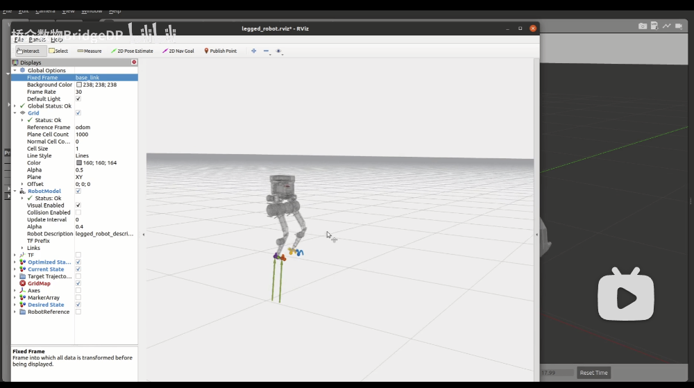
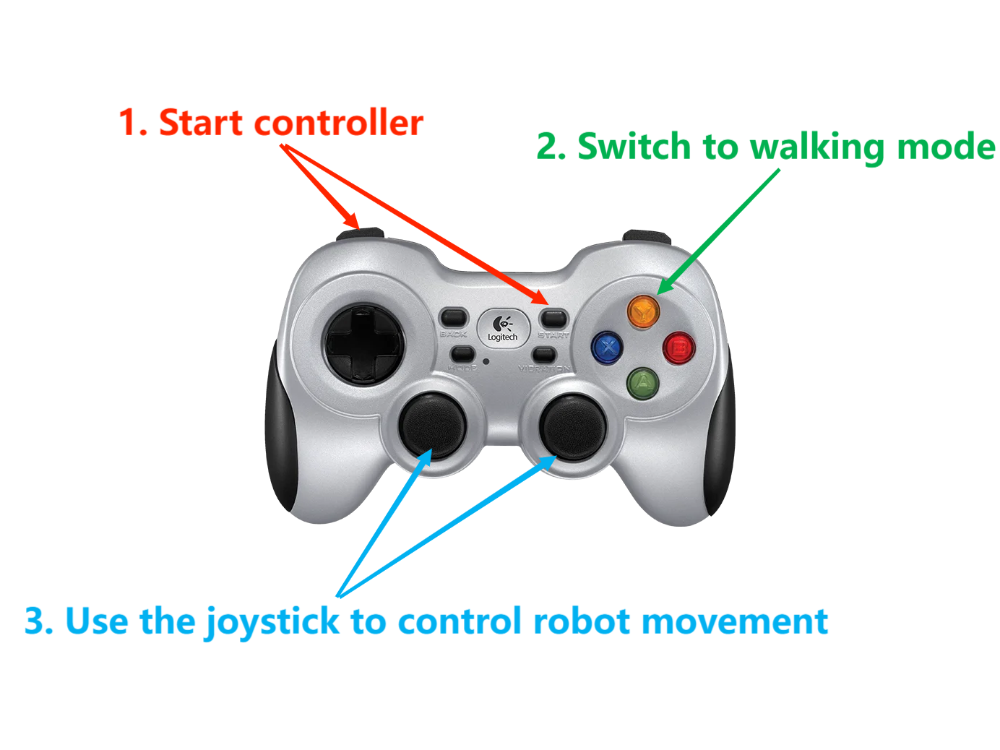

## hunter_bipedal_control

An open source bipedal robot control framework, based on non-linear MPC and WBC, tailered for EC-hunter80-v01 bipedal robot. For more information refer to the project's [Page](https://bridgedp.github.io/hunter_bipedal_control). 

[More detailed hardware information about hunter and bipedal robot communication group](https://f0exxg5fp6u.feishu.cn/docx/D1aQdM337ovKYnxRyJMcGibunoh) 

## Installation

### Install dependencies

- [OCS2](https://leggedrobotics.github.io/ocs2/installation.html#prerequisites)

- [ROS1-Noetic](http://wiki.ros.org/noetic)

- [LCM](https://github.com/lcm-proj/lcm) (Only required when using mujoco simulation)

### Clone and Build

```shell
# Clone
mkdir -p <catkin_ws_name>/src
cd <catkin_ws_name>/src
git clone https://github.com/bridgedp/hunter_bipedal_control.git

# Build
cd <catkin_ws_name>
catkin init
catkin config -DCMAKE_BUILD_TYPE=RelWithDebInfo

# for different use build 
# 1. gazebo simulation 
catkin build legged_controllers legged_hunter_description legged_gazebo

# 2. mujoco simulation
catkin build legged_controllers legged_hunter_description legged_mujoco lcm_msg mujoco
```

## Quick Start
- Gazebo Simulation 
[](https://www.bilibili.com/video/BV1yF4m157F6/?share_source=copy_web&vd_source=40bb9ce8f091be0c579acdb44d366a2d)

- Mujoco Simulation


### Simulation

1. Run the gazebo simulation and load the controller:

```shell
roslaunch legged_controllers one_start_gazebo.launch
```

2. Run the mujoco simulation and load the controller:
```shell
roslaunch legged_controllers one_start_mujoco.launch
```

### Robot hardware

1. load the controller

```shell
roslaunch legged_controllers one_start_real.launch
```

***Notes:***  
    After the user starts the simulation, the robot falls down in Gazebo OR Mujoco. 
1. Gazebo
    First the user needs to set ***kp_position=100***, ***kd_position=3*** in rqt (need refresh) and reset the simulation by pressing ***Ctrl+Shift+R*** to make the robot stand up.
2. Mujoco
    First the user needs to set ***kp_position=100***, ***kd_position=3*** in rqt (need refresh) and reset the simulation by clicking ***Reload*** to make the robot stand up.

    Then, send the following commands:
    ```bash
    rostopic pub --once /reset_estimation std_msgs/Float32 "data: 1.23"
    ```
    This command will reset the state estimation information because ***Reload*** brings mutation effects to the state estimation.

## Gamepad Control

1. Start controller

```
L1 + start
```

2. Switch to walking mode

```
Y
```

3. Use the joystick to control robot movement

The following is a schematic diagram of the handle operation:



## Simulation Without Gamepad

Compilation: Only compile the following packages (and their dependencies), there's no need to compile the entire OCS2.

1. Gazebo Simulation
```bash
catkin build legged_controllers legged_hunter_description legged_gazebo
```

Execution: If you don't have a gamepad, you need to send the startup commands in order.

First, set ***kp_position=100*** in rqt and reset the simulation by pressing ***Ctrl+Shift+R*** to make the robot stand up. Then, send the following commands:

```bash
rostopic pub --once /load_controller std_msgs/Float32 "data: 1.23"
rostopic pub --once /set_walk std_msgs/Float32 "data: 1.23"
```

***Before /load_controller, there needs to be a node continuously sending /cmd_vel (10Hz is normal), and it should continue sending during the simulation. Once /cmd_vel stops, the robot may fall.***

As a example, here's a Python script that continuously sends /cmd_vel and allows keyboard control. You should start the script before  /load_controller. 

```python
#!/usr/bin/env python

import rospy
from geometry_msgs.msg import Twist
from pynput import keyboard
import threading

class KeyboardController:
    def __init__(self):
        self.publisher = rospy.Publisher('/cmd_vel', Twist, queue_size=1)
        self.twist_msg = Twist()
        self.rate = rospy.Rate(10)

    def on_press(self, key):
        try:
            if key.char == 'q':
                rospy.signal_shutdown("Quit")
            else:
                if key.char == 'w':
                    self.twist_msg.linear.x = 0.35
                elif key.char == 's':
                    self.twist_msg.linear.x = -0.35
                else:
                    self.twist_msg.linear.x = 0.0

                if key.char == 'a':
                    self.twist_msg.angular.z = 0.35
                elif key.char == 'd':
                    self.twist_msg.angular.z = -0.35
                else:
                    self.twist_msg.angular.z = 0.0
        except AttributeError:
            pass

    def on_release(self, key):
        self.twist_msg.linear.x = 0.0
        self.twist_msg.angular.z = 0.0

def ros_publish():
    while not rospy.is_shutdown():
        controller.publisher.publish(controller.twist_msg)
        controller.rate.sleep()


if __name__ == '__main__':
    rospy.init_node("keyboard_control")
    controller = KeyboardController()

    thread = threading.Thread(target=ros_publish)
    thread.start()

    listener = keyboard.Listener(on_press=controller.on_press, on_release=controller.on_release)
    listener.start()
    while not rospy.is_shutdown():
        pass

    listener.stop()
    listener.join()
    
    thread.join()
```
2. Mujoco Simulation
```bash
catkin build legged_controllers legged_hunter_description legged_mujoco lcm_msg mujoco
```
Execution: If you don't have a gamepad, you need to send the startup commands in order.

First, set ***kp_position=100*** ***kd_position=3***  in rqt and reset the simulation by clicking ***Reload*** to make the robot stand up. Then, send the following commands:

```bash
rostopic pub --once /reset_estimation std_msgs/Float32 "data: 1.23"
rostopic pub --once /load_controller std_msgs/Float32 "data: 1.23"
rostopic pub --once /set_walk std_msgs/Float32 "data: 1.23"
```
and 
```bash
rosrun rqt_robot_steering rqt_robot_steering 
```

## Running on Hardware Headless

1. Plug a monitor into the onboard mini pc. Login to a local network and double check the computer name and user name.

2. Power the mini PC from the onboard battery it should automatically connect to the local network.

3. Open a terminal, power shell, or any ternimal emulator (PuTTY) from another PC on the same network.

```bash
ssh <username@hostname>
```

```bash
cd Desktop/hunter_bipedal_control/ 
sudo su
source devel/setup.bash
roslaunch legged_controllers one_start_real.launch rviz:=false
```

4. Hold L1 and **slowly** push L2 to the end to increase ***kp_position***.

5. The rest of the steps are the same as controlling in simulation. 

## Reference

### Code Reference

https://github.com/qiayuanl/legged_control

### Paper Reference

#### State Estimation

```
[1] Flayols T, Del Prete A, Wensing P, et al. Experimental evaluation of simple estimators for humanoid robots[C]//2017 IEEE-RAS 17th International Conference on Humanoid Robotics (Humanoids). IEEE, 2017: 889-895.

[2] Bloesch M, Hutter M, Hoepflinger M A, et al. State estimation for legged robots-consistent fusion of leg kinematics and IMU[J]. Robotics, 2013, 17: 17-24.

```

#### MPC

```
[3] Di Carlo J, Wensing P M, Katz B, et al. Dynamic locomotion in the mit cheetah 3 through convex model-predictive control[C]//2018 IEEE/RSJ international conference on intelligent robots and systems (IROS). IEEE, 2018: 1-9.

[4] Grandia R, Jenelten F, Yang S, et al. Perceptive Locomotion Through Nonlinear Model-Predictive Control[J]. IEEE Transactions on Robotics, 2023.

[5] Sleiman J P, Farshidian F, Minniti M V, et al. A unified mpc framework for whole-body dynamic locomotion and manipulation[J]. IEEE Robotics and Automation Letters, 2021, 6(3): 4688-4695.
```

#### WBC

```
[6] Bellicoso C D, Gehring C, Hwangbo J, et al. Perception-less terrain adaptation through whole body control and hierarchical optimization[C]//2016 IEEE-RAS 16th International Conference on Humanoid Robots (Humanoids). IEEE, 2016: 558-564.

[7] Kim D, Di Carlo J, Katz B, et al. Highly dynamic quadruped locomotion via whole-body impulse control and model predictive control[J]. arXiv preprint arXiv:1909.06586, 2019.
```
